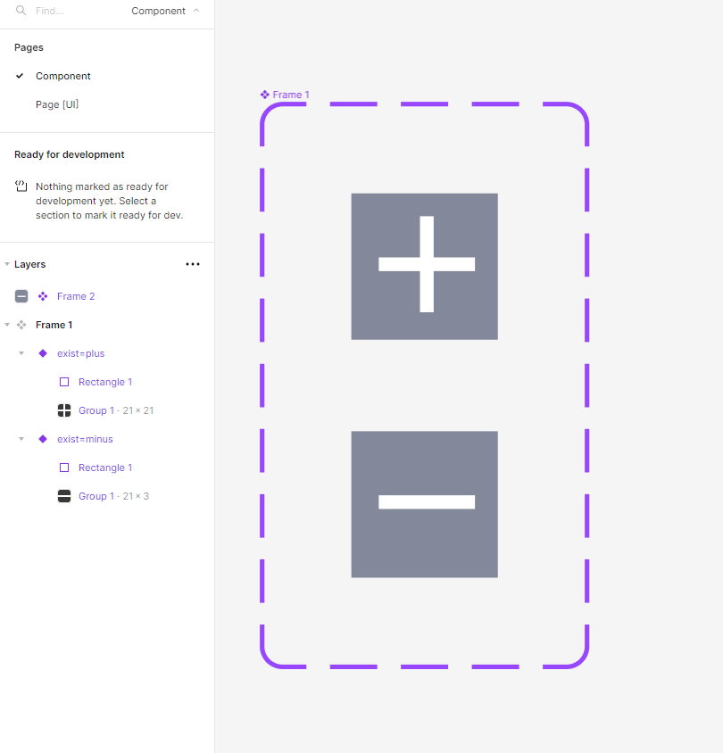
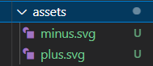
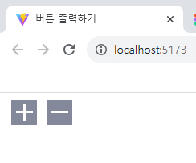

# 컴포넌트 만들기 과제
---

조건부 렌더링 코드 추가 예정

---

피그마에서 버튼을 디자인한 뒤 svg 파일을 assets 안으로  가져왔다.

PlusButton.jsx 파일 안에 PlusButton 컴포넌트와
MinusButton.jsx 파일 안에 MinusButton 컴포넌트를 생성해주고,
main.jsx 파일에서 불러와 화면에 렌더링해주었다.